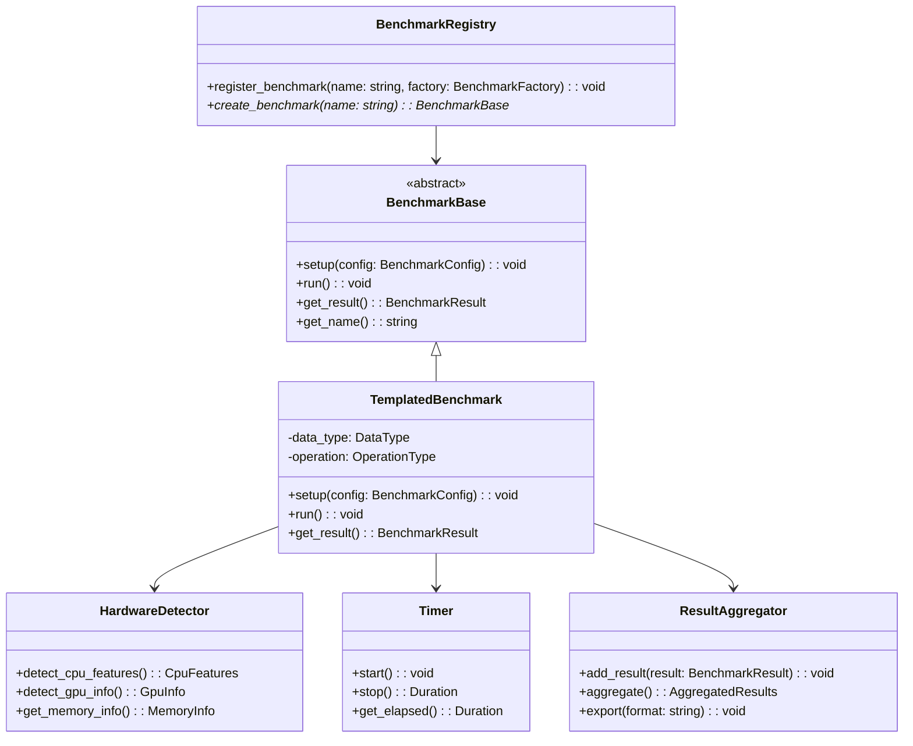

# Benchmark Framework Design

## Overview
This document outlines the design for a comprehensive, robust, and granular benchmark framework tailored for the Hartonomous project, which involves n-dimensional embedding projections to 4D space using custom coordinate systems, orthonormalization (Gram-Schmidt), and operations on Unicode character embeddings (1.2M+ characters).

The framework builds upon research into Intel MKL, Eigen, HNSWLIB, VNNI, AVX/SIMD, and targets hardware like Intel 14900KS (with AVX-512, VNNI), Asus Z790 motherboard, and Nvidia 4060 GPU.

Key features:
- Abstract base classes for benchmarks
- Templated for data types (float, double, custom) and operations
- Enhanced hardware detection (CPU features, GPU info)
- High-precision timing utilities (C++23 chrono)
- Result aggregation and analysis
- Extensibility for new benchmarks and libraries
- C++23 compatibility where possible

## Architecture

### Core Components

#### 1. Base Benchmark Class Hierarchy
```cpp
template<typename DataType, typename OperationType>
class BenchmarkBase {
public:
    virtual ~BenchmarkBase() = default;
    virtual void setup(const BenchmarkConfig& config) = 0;
    virtual void run() = 0;
    virtual BenchmarkResult get_result() const = 0;
    virtual std::string get_name() const = 0;
};

template<typename DataType, typename OperationType>
class TemplatedBenchmark : public BenchmarkBase<DataType, OperationType> {
    // Common implementation for templated benchmarks
};
```

#### 2. Hardware Detection Module
Enhanced from existing `src/hardware.cpp` to include:
- AVX-512, VNNI detection
- GPU detection (Nvidia 4060 via CUDA/OpenCL)
- Memory info, cache sizes
- Processor specifics (14900KS features)

#### 3. Timing Utilities
Using C++23 `std::chrono` for high-precision timing:
- Wall clock time
- CPU time
- Memory bandwidth measurements
- Custom timers for operations

#### 4. Result Aggregation
- JSON/CSV output compatible with existing scripts
- Statistical analysis (mean, std dev, percentiles)
- Hardware context inclusion
- Comparison across runs/configs

#### 5. Extensibility
- Plugin system for new libraries (MKL, Eigen, HNSWLIB)
- Registry for benchmark types
- Configuration-driven benchmark selection

## Class Diagram



## Integration Plan

### Project Structure Updates
- `src/benchmark/` : Core framework classes
- `src/hardware/` : Enhanced hardware detection
- `src/timing/` : Timing utilities
- `src/results/` : Result aggregation
- `benchmarks/` : Specific benchmark implementations (e.g., embedding projection, orthonormalization)
- Update CMakeLists.txt for C++23 and new dependencies

### CMake Updates
- Set CMAKE_CXX_STANDARD 23
- Add find_package for MKL, Eigen, HNSWLIB
- Link libraries appropriately

### Existing Integration
- Extend `benchmark_main.cpp` to use new framework
- Update scripts to handle new result formats
- CI/CD remains similar, with additional artifact uploads

## Detailed Specifications

### Benchmark Types
1. **Matrix Operations**: For projection matrices (Eigen, MKL)
   - Matrix multiplication for embedding projections
   - Eigen decomposition for orthonormal bases
   - Custom 4D coordinate system transformations

2. **Vector Operations**: Embedding vectors (SIMD/AVX, VNNI)
   - Vector dot products for similarity calculations
   - Normalization and scaling of high-dimensional vectors
   - Batch processing of 1.2M+ Unicode character embeddings

3. **Orthonormalization**: Gram-Schmidt process
   - Iterative orthonormalization for embedding bases
   - Stability checks and numerical precision benchmarks
   - Comparison of CPU vs GPU implementations

4. **Nearest Neighbor Search**: HNSWLIB for 4D projections
   - Approximate NN for sphere-surface projections
   - Index construction and query performance
   - Memory usage for large embedding spaces

5. **GPU Benchmarks**: Leveraging Nvidia 4060
   - CUDA kernels for vectorized operations
   - Memory transfer benchmarks (CPU-GPU)
   - Parallel processing of embedding batches

6. **Memory Bandwidth**: For large embedding datasets
   - Cache efficiency for embedding access patterns
   - Bandwidth saturation tests
   - NUMA-aware memory allocation

### Data Types
- float, double for numerical precision
- Custom vector/matrix types for embeddings
- Unicode-aware types for character projections

### Hardware Considerations
- **CPU (Intel 14900KS)**: Leverage AVX-512/VNNI for vectorized operations, multi-threading for parallel processing
- **GPU (Nvidia 4060)**: CUDA acceleration for large-scale projections, tensor cores for matrix ops
- **Motherboard (Asus Z790)**: High-speed PCIe for GPU communication, DDR5 memory support
- Memory optimization for 1.2M+ character embeddings: NUMA awareness, cache-friendly data layouts

### Embeddings-Specific Features
- **4D Projection Benchmarks**: Measure accuracy and performance of sphere-surface projections
- **Unicode Character Handling**: Benchmarks for processing 1.2M+ characters, encoding/decoding overhead
- **Orthonormal Basis Construction**: Time and stability of Gram-Schmidt on high-dimensional data
- **Similarity Search**: HNSW index build/query times for 4D embedded space
- **Batch Processing**: GPU-accelerated batch normalization and transformation of embedding matrices

### Extensibility Mechanisms
- Factory pattern for benchmark creation
- Configuration files (JSON/YAML) for benchmark parameters
- Plugin interfaces for third-party libraries

This design provides a solid foundation for benchmarking the Hartonomous embedding projection system while maintaining compatibility with the existing suite.