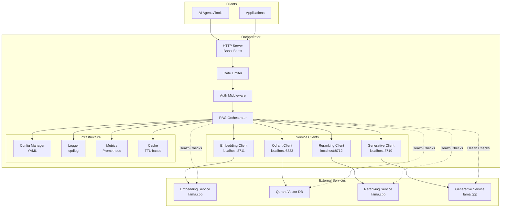

# Hartonomous Orchestrator Architecture

## System Overview
A production-grade C++ REST API server that orchestrates Retrieval-Augmented Generation (RAG) operations by coordinating calls to OpenAI-compatible endpoints and a Qdrant vector database.

## Architecture Diagram

## API Endpoints

### RAG Operations
- `POST /rag/ingest` - Ingest documents for RAG
- `POST /rag/query` - Perform RAG query
- `POST /rag/batch-query` - Batch RAG queries

### OpenAI Proxy Endpoints
- `POST /v1/chat/completions` - Proxy to generative service
- `POST /v1/embeddings` - Proxy to embedding service
- `POST /v1/rerank` - Proxy to reranking service

### Monitoring & Operations
- `GET /health` - Health check
- `GET /ready` - Readiness check
- `GET /metrics` - Prometheus metrics
- `POST /admin/config/reload` - Reload configuration
- `GET /admin/logs` - Log access

## Key Components

### HTTP Server Layer
- Boost.Beast for high-performance HTTP/HTTPS
- Async request handling with C++20 coroutines
- Middleware for authentication, rate limiting, logging

### Orchestration Logic
- Async coordination of multiple service calls
- Error handling with circuit breaker pattern
- Retry logic with exponential backoff
- Request tracing and correlation IDs

### Service Clients
- REST clients for each external service
- Connection pooling and keep-alive
- Request/response validation
- Timeout and cancellation handling

### Infrastructure
- YAML-based configuration management
- Structured logging with spdlog
- Prometheus metrics collection
- In-memory caching with TTL

## Enterprise Features
- **Reliability**: Circuit breakers, retries, graceful degradation
- **Security**: API key auth, request validation, HTTPS support
- **Observability**: Comprehensive metrics, tracing, audit logs
- **Scalability**: Stateless design, async processing, batch operations
- **Operations**: Docker/K8s ready, health checks, config reload