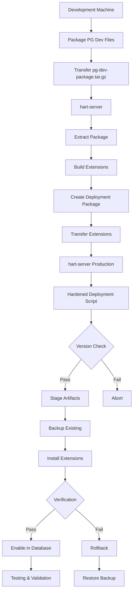
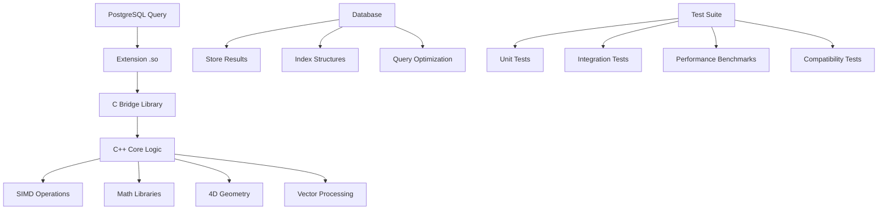

# Hardened PostgreSQL Extension Deployment Guide

Complete guide for the hardened PostgreSQL extension deployment process, including staging, testing, and production deployment procedures.

## Table of Contents

1. [Overview](#overview)
2. [Prerequisites](#prerequisites)
3. [Step-by-Step Deployment Guide](#step-by-step-deployment-guide)
4. [Testing Procedures](#testing-procedures)
5. [Troubleshooting](#troubleshooting)
6. [Architecture Diagrams](#architecture-diagrams)

---

## Overview

### Architecture Overview

The hardened PostgreSQL extension deployment pipeline provides a production-ready, enterprise-grade process for cross-compiling and deploying PostgreSQL extensions with comprehensive safeguards, rollback capabilities, and automated validation.

#### Key Components

**Development Environment** (Windows/Linux)
- PostgreSQL development package extraction from production server
- Cross-compilation using packaged headers and libraries
- Version compatibility validation

**Unified Database Wrapper Architecture**
- `db_wrapper_pg.so` - Shared library containing all PostgreSQL database interactions
- Extensions link to wrapper but not directly to PostgreSQL libraries
- Clean separation between database access (wrapper) and computation (extensions)

**Staging Area** (`/opt/libraries/postgresql`)
- Version-controlled extension and wrapper library storage
- Metadata tracking and verification
- Backup and rollback capabilities

**Production Deployment**
- Automated installation with integrity checks
- Rollback-on-failure mechanisms
- Comprehensive logging and error handling

#### Hardened Pipeline Features

- **Version Safety**: Ensures extensions match PostgreSQL version exactly
- **Rollback Protection**: Automatic backup and recovery on deployment failure
- **Dry-Run Capability**: Validate deployments without making changes
- **Comprehensive Testing**: Unit, integration, performance, and compatibility tests
- **Staging Isolation**: Extensions staged before production installation
- **Metadata Tracking**: Build information and deployment history

---

## Prerequisites

### System Requirements

#### Development Machine
- Linux (Ubuntu 20.04+) or Windows with WSL/Git Bash
- CMake 3.10+
- GCC 9+ or compatible compiler
- Git for repository access

#### Production Server (hart-server)
- PostgreSQL 12+ with development headers
- Root/sudo access for installation
- `/opt/libraries` directory permissions

### Required Dependencies

#### Development Dependencies
```bash
# Ubuntu/Debian
sudo apt-get update
sudo apt-get install -y \
    build-essential \
    cmake \
    git \
    pkg-config \
    libssl-dev \
    uuid-dev
```

#### PostgreSQL Development Package
```bash
# On hart-server - install development headers
sudo apt-get install postgresql-server-dev-all

# Verify installation
pg_config --version
pg_config --includedir
pg_config --libdir
```

### Network Access Requirements
- SSH access from dev machine to hart-server
- SCP file transfer capabilities
- No firewall restrictions for PostgreSQL ports

---

## Step-by-Step Deployment Guide

### 1. Package PostgreSQL Dev Files from Server

**Location**: `deployment/package-pg-dev-from-server.sh`  
**Executed on**: hart-server

This script packages PostgreSQL development headers, libraries, and configuration utilities from the production server.

```bash
# On hart-server
cd ~
./Hartonomous-Opus/deployment/package-pg-dev-from-server.sh

# Output: ~/pg-dev-package.tar.gz
ls -lh ~/pg-dev-package.tar.gz
```

**What it creates**:
- `pg-dev-package/bin/pg_config` - PostgreSQL configuration utility
- `pg-dev-package/include/` - Client headers (libpq)
- `pg-dev-package/include-server/` - Server extension headers
- `pg-dev-package/lib/` - PostgreSQL libraries
- `pg-dev-package/pg-config.env` - Environment setup script

### 2. Transfer Package to Development Machine

```bash
# From development machine
scp ahart@hart-server:~/pg-dev-package.tar.gz .

# Extract package
tar -xzf pg-dev-package.tar.gz
cd pg-dev-package

# Verify contents
ls -la
source pg-config.env
pg_config --version  # Should show hart-server's PostgreSQL version
```

### 3. Build Extensions with Packaged Files

**Location**: `deployment/build-extensions-with-pg-dev.sh`  
**Executed on**: Development machine

This script uses the packaged PostgreSQL development files to cross-compile extensions.

```bash
# From Hartonomous-Opus/deployment directory
./build-extensions-with-pg-dev.sh

# Output: ~/hartonomous-pg-extensions.tar.gz
ls -lh ~/hartonomous-pg-extensions.tar.gz
```

**Build process**:
1. Sources `pg-dev-package/pg-config.env` for PostgreSQL environment
2. Configures CMake with extension and wrapper targets
3. Builds database wrapper library (`db_wrapper_pg.so`) - only component linking to PostgreSQL libraries
4. Builds five core extensions (link to wrapper, not directly to PostgreSQL):
   - `hypercube.so` - 4D geometry functions
   - `generative.so` - Text generation
   - `hypercube_ops.so` - 4D type operators
   - `embedding_ops.so` - Vector similarity operations
   - `semantic_ops.so` - Semantic search operations
5. Packages extensions, wrapper, and SQL definitions/control files

### 4. Deploy Using Hardened Pipeline

**Location**: `deployment/linux/deploy-postgresql-extensions-hardened.sh`  
**Executed on**: hart-server

The hardened deployment script provides enterprise-grade deployment with staging, backup, and rollback capabilities.

#### Standard Deployment

```bash
# On hart-server
cd Hartonomous-Opus/deployment/linux
./deploy-postgresql-extensions-hardened.sh
```

#### Advanced Options

```bash
# Dry run to validate without changes
./deploy-postgresql-extensions-hardened.sh --dry-run

# Custom staging directory
./deploy-postgresql-extensions-hardened.sh --staging-dir /custom/staging/path

# Skip build (use pre-built extensions)
./deploy-postgresql-extensions-hardened.sh --skip-build

# Verbose logging
./deploy-postgresql-extensions-hardened.sh --verbose
```

#### Deployment Stages

1. **Version Compatibility Check**
   - Validates PostgreSQL version >= 12
   - Confirms pg_config availability

2. **Extension Building** (unless --skip-build)
   - Sources PostgreSQL environment
   - CMake configuration for extensions only
   - Parallel compilation

3. **Artifact Staging**
   - Creates `/opt/libraries/postgresql/[version]/` directory
   - Copies `.so`, `.control`, and `.sql` files
   - Generates metadata file with build information

4. **Production Installation**
   - Creates backup of existing extensions
   - Installs to PostgreSQL directories
   - Verifies installation integrity
   - Automatic rollback on failure

5. **Post-Installation Validation**
   - Confirms all extensions loaded
   - Tests basic functionality

### 5. Enable Extensions in Database

After successful deployment, enable extensions in the hypercube database:

```bash
sudo -u postgres psql hypercube << SQL
CREATE EXTENSION IF NOT EXISTS hypercube;
CREATE EXTENSION IF NOT EXISTS hypercube_ops;
CREATE EXTENSION IF NOT EXISTS embedding_ops;
CREATE EXTENSION IF NOT EXISTS generative;
CREATE EXTENSION IF NOT EXISTS semantic_ops;

-- Verify installation
\\dx

-- Test basic functionality
SELECT hc_map_codepoint(65);  -- Should return 4D coordinates for 'A'
SQL
```

### Staging Area Structure

The hardened pipeline uses a structured staging area:

```
/opt/libraries/postgresql/
├── 16.2/                          # PostgreSQL version
│   ├── db_wrapper_pg.so          # Database wrapper library (links to PostgreSQL)
│   ├── hypercube.so              # Core geometry extension
│   ├── generative.so             # Text generation
│   ├── hypercube_ops.so          # 4D operators
│   ├── embedding_ops.so          # Vector operations
│   ├── semantic_ops.so           # Semantic search
│   ├── hypercube.control         # Extension metadata
│   ├── hypercube--1.0.sql        # SQL definitions
│   └── metadata.json             # Deployment metadata (includes wrapper info)
└── 15.4/                          # Previous version (rollback)
    └── ...
```

---

## Testing Procedures

### Unit Tests for Extensions

#### PostgreSQL Extension Tests

Run the comprehensive SQL validation suite:

```bash
# On hart-server with extensions loaded
cd Hartonomous-Opus/tests/sql

# Full validation test
psql -U postgres -d hypercube -f validate_full.sql

# Expected output shows PASS for all validation checks:
# - STATS: Total atoms, codepoints, compositions
# - BINARY_CHECK: PASS (all compositions have 2 children)
# - ORPHAN_CHECK: PASS (no invalid child references)
# - ATOM_COUNT_CHECK: PASS (parent counts match children sums)
# - LEAF_CHECK: PASS (codepoints have no children)
# - COMP_CHECK: PASS (compositions have children)
# - GEOMETRY_CHECK: Centroid and geometry data present
```

#### Individual Component Tests

```sql
-- Test hypercube functions
SELECT hc_map_codepoint(65);           -- Basic mapping
SELECT hc_map_codepoint(32768);        -- Higher codepoint
SELECT hc_codepoint_from_coords(0.5, 0.5, 0.5, 0.5); -- Reverse mapping

-- Test generative functions (requires vocabulary)
SELECT gen_generate('The', 5);        -- Text generation

-- Test embedding operations
SELECT embedding_cosine_similarity(a.embedding, b.embedding)
FROM embeddings a, embeddings b
WHERE a.id = 1 AND b.id = 2;

-- Test semantic operations
SELECT * FROM semantic_search('query text', 10);
```

### Integration Tests with PostgreSQL

#### Database Schema Validation

```bash
# Test three-table schema integration
psql -U postgres -d hypercube -f test_three_table_schema.sql

# Test enterprise ingestion pipeline
psql -U postgres -d hypercube -f test_enterprise_suite.sql

# Test ingestion workflows
psql -U postgres -d hypercube -f test_ingestion.sql
```

#### Performance Validation

```sql
-- Test index usage on spatial queries
EXPLAIN ANALYZE
SELECT * FROM composition
ORDER BY ST_Distance(centroid, ST_MakePoint(0.5, 0.5, 0.5, 0.5))
LIMIT 10;

-- Test semantic search performance
EXPLAIN ANALYZE
SELECT * FROM semantic_search('machine learning', 100);
```

### Performance Benchmarks

#### Using the Benchmark Suite

The project includes a comprehensive benchmarking suite for performance validation:

```bash
# From Hartonomous-Benchmark directory
cd Hartonomous-Benchmark

# Build benchmarks
mkdir build && cd build
cmake -DCMAKE_BUILD_TYPE=Release ..
make -j$(nproc)

# Run extension-specific benchmarks
./build/benchmarks/benchmark_suite --benchmark_filter="Hypercube|Embedding"

# Run memory benchmarks to validate extension performance
./build/benchmarks/benchmark_suite --benchmark_filter="Memory.*"

# Generate performance report
./scripts/analyze_results.sh
```

#### PostgreSQL-Specific Benchmarks

```sql
-- Benchmark hypercube mapping performance
\\timing on

-- Single codepoint mapping (micro-benchmark)
SELECT hc_map_codepoint(generate_series(1, 10000));

-- Batch processing benchmark
CREATE TEMP TABLE benchmark_data AS
SELECT generate_series(1, 100000) as id;

SELECT COUNT(*) FROM (
    SELECT hc_map_codepoint(id) FROM benchmark_data
) t;

-- Cleanup
DROP TABLE benchmark_data;
```

#### System Resource Monitoring

```bash
# Monitor during benchmark execution
top -p $(pgrep postgres)  # PostgreSQL processes
iostat -x 1               # I/O statistics
free -h                   # Memory usage
```

### Version Compatibility Testing

#### PostgreSQL Version Matrix

Test extensions against multiple PostgreSQL versions:

```bash
# Test script for version compatibility
#!/bin/bash
VERSIONS=("12" "13" "14" "15" "16")

for version in "${VERSIONS[@]}"; do
    echo "Testing PostgreSQL $version..."

    # Use hardened deployment with version-specific staging
    ./deploy-postgresql-extensions-hardened.sh \
        --staging-dir "/opt/libraries/postgresql/test-$version" \
        --pg-config "/usr/lib/postgresql/$version/bin/pg_config"

    # Run validation tests
    psql -h /tmp/pg-$version -d test -f validate_full.sql
done
```

#### Extension ABI Compatibility

```sql
-- Test extension loading across restarts
SELECT * FROM pg_extension WHERE extname LIKE '%hypercube%';

-- Test function availability
SELECT proname FROM pg_proc
WHERE proname LIKE 'hc_%' OR proname LIKE 'gen_%'
ORDER BY proname;

-- Test type availability
SELECT typname FROM pg_type
WHERE typname LIKE '%hypercube%' OR typname LIKE '%embedding%';
```

#### Cross-Platform Compatibility

Test extensions built on different architectures:

```bash
# On ARM64 build machine
./build-extensions-with-pg-dev.sh

# Deploy to x86_64 server (requires compatible PostgreSQL version)
scp ~/hartonomous-pg-extensions.tar.gz user@target-server:~/
ssh user@target-server './deploy-postgresql-extensions-hardened.sh'
```

---

## Troubleshooting

### Common Deployment Issues

#### "pg_config not found" Error

**Symptom**: Build fails with "pg_config: command not found"

**Solution**:
```bash
# On hart-server - install development package
sudo apt-get install postgresql-server-dev-all

# Verify installation
which pg_config
pg_config --version

# Re-package development files
./package-pg-dev-from-server.sh
```

#### Version Mismatch Errors

**Symptom**: "ERROR: incompatible library version"

**Cause**: Extensions built against different PostgreSQL version than target server

**Solution**:
```bash
# Check versions
pg_config --version  # On hart-server

# In pg-dev-package directory
source pg-config.env
pg_config --version  # Should match hart-server

# If mismatch, re-package from correct server
ssh ahart@hart-server './package-pg-dev-from-server.sh'
scp ahart@hart-server:~/pg-dev-package.tar.gz .
```

#### Staging Directory Permission Errors

**Symptom**: "Permission denied" when creating `/opt/libraries/postgresql`

**Solution**:
```bash
# Create staging directory with proper permissions
sudo mkdir -p /opt/libraries
sudo chown $USER:$USER /opt/libraries

# Or run deployment with sudo
sudo ./deploy-postgresql-extensions-hardened.sh
```

#### Extension Loading Failures

**Symptom**: "ERROR: could not load library" in PostgreSQL logs

**Solutions**:

1. **Missing Dependencies**:
```bash
# Check library dependencies
ldd /usr/lib/postgresql/16/lib/hypercube.so

# Install missing system libraries
sudo apt-get install libssl-dev uuid-dev
```

2. **Incorrect Installation Path**:
```bash
# Verify installation locations
pg_config --pkglibdir  # Should contain .so files
pg_config --sharedir   # Should contain extension/ directory

# Check file permissions
ls -la $(pg_config --pkglibdir)/hypercube.so
```

3. **ABI Incompatibility**:
```bash
# Rebuild extensions with current PostgreSQL version
./package-pg-dev-from-server.sh  # Fresh package
./build-extensions-with-pg-dev.sh  # Rebuild
./deploy-postgresql-extensions-hardened.sh  # Redeploy
```

### Testing and Validation Issues

#### Validation Tests Failing

**Symptom**: SQL validation queries return FAIL status

**Common Causes**:

1. **Data Corruption**:
```sql
-- Check data integrity
SELECT COUNT(*) FROM atom;
SELECT COUNT(*) FROM relation;

-- Rebuild corrupted indexes
REINDEX TABLE atom;
REINDEX TABLE relation;
```

2. **Extension Not Loaded**:
```sql
-- Verify extensions are active
\\dx

-- Reload extensions if needed
DROP EXTENSION IF EXISTS hypercube;
CREATE EXTENSION hypercube;
```

#### Performance Benchmark Failures

**Symptom**: Benchmarks show significantly degraded performance

**Diagnosis**:
```bash
# Check system resources
vmstat 1
iostat -x 1
free -h

# Check PostgreSQL configuration
SHOW shared_buffers;
SHOW work_mem;
SHOW maintenance_work_mem;

# Verify indexes exist
\\di
```

**Solutions**:
```sql
-- Optimize PostgreSQL settings
ALTER SYSTEM SET shared_buffers = '256MB';
ALTER SYSTEM SET work_mem = '64MB';

-- Recreate performance indexes
CREATE INDEX CONCURRENTLY IF NOT EXISTS idx_atom_centroid
    ON atom USING gist (centroid);

CREATE INDEX CONCURRENTLY IF NOT EXISTS idx_composition_geom
    ON composition USING gist (geom);
```

### Rollback Procedures

#### Automatic Rollback (Deployment Failure)

The hardened pipeline automatically handles rollback on deployment failures:

```bash
# Check deployment logs
tail -f /var/log/postgresql/deployment-$(date +%Y%m%d).log

# Manual rollback if needed
cd /opt/libraries/postgresql
sudo cp backup/hypercube.so $(pg_config --pkglibdir)/
sudo systemctl restart postgresql
```

#### Emergency Extension Disable

```sql
-- Disable problematic extensions
DROP EXTENSION IF EXISTS semantic_ops;
DROP EXTENSION IF EXISTS embedding_ops;
DROP EXTENSION IF EXISTS hypercube_ops;
DROP EXTENSION IF EXISTS generative;
DROP EXTENSION IF EXISTS hypercube;

-- Restart PostgreSQL service
sudo systemctl restart postgresql
```

### Network and Transfer Issues

#### SCP Transfer Failures

**Symptom**: "Connection refused" or transfer timeouts

**Solutions**:
```bash
# Test connectivity
ssh ahart@hart-server 'echo "Connection OK"'

# Use alternative transfer methods
rsync -avz ~/pg-dev-package.tar.gz ahart@hart-server:~/

# For large files, use compression
tar -czf - pg-dev-package/ | ssh ahart@hart-server 'cat > pg-dev-package.tar.gz'
```

#### Disk Space Issues

**Symptom**: "No space left on device" during build or staging

**Solutions**:
```bash
# Check disk usage
df -h

# Clean old builds
rm -rf ~/pg-dev-package/
rm -rf cpp/build-pg-extensions/

# Use alternative staging location
./deploy-postgresql-extensions-hardened.sh --staging-dir /var/tmp/postgresql-staging
```

---

## Architecture Diagrams

### Deployment Flow



### Directory Structure

```mermaid
graph TD
    A[/opt/libraries] --> B[postgresql/]
    B --> C[16.2/]
    B --> D[15.4/]

    C --> E[hypercube.so]
    C --> F[generative.so]
    C --> G[hypercube_ops.so]
    C --> H[embedding_ops.so]
    C --> I[semantic_ops.so]
    C --> J[*.control files]
    C --> K[*--*.sql files]
    C --> L[metadata.json]

    D --> M[backup/]
    M --> N[previous versions]

    O[PostgreSQL Directories] --> P[/usr/lib/postgresql/16/lib/]
    O --> Q[/usr/share/postgresql/16/extension/]

    P --> R[hypercube.so]
    Q --> S[hypercube.control]
    Q --> T[hypercube--1.0.sql]
```

### Extension Architecture



---

## Integration with Existing Documentation

This guide builds upon and integrates with existing documentation:

- **POSTGRESQL_EXTENSIONS.md**: Basic build and deploy process
- **QUICKSTART.md**: Getting started guide
- **README.md**: Project overview

### Related Files

- `deployment/package-pg-dev-from-server.sh` - PG dev file packaging
- `deployment/build-extensions-with-pg-dev.sh` - Extension building
- `deployment/linux/deploy-postgresql-extensions-hardened.sh` - Hardened deployment
- `tests/sql/validate_full.sql` - Comprehensive validation
- `Hartonomous-Benchmark/` - Performance testing suite

### Migration from Basic to Hardened Deployment

Existing deployments can migrate to the hardened pipeline:

```bash
# Backup current extensions
sudo cp -r /usr/lib/postgresql/*/lib/hypercube* /tmp/extension-backup/
sudo cp -r /usr/share/postgresql/*/extension/hypercube* /tmp/extension-backup/

# Deploy using hardened pipeline
./deploy-postgresql-extensions-hardened.sh

# Verify and cleanup
sudo -u postgres psql -d hypercube -c "SELECT hc_map_codepoint(65);"
rm -rf /tmp/extension-backup
```

---

*This documentation integrates with the existing PostgreSQL extensions guide while providing comprehensive coverage of the hardened deployment pipeline, testing procedures, and production operational requirements.*