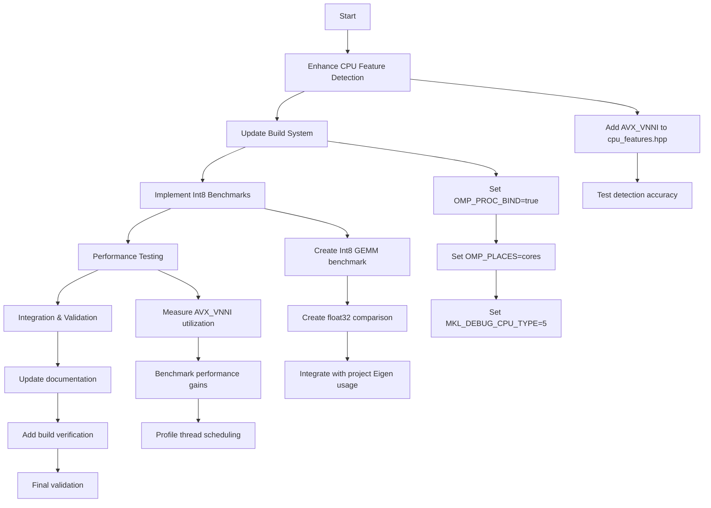

# AVX2/AVX_VNNI Optimization and Int8 Quantization Implementation Plan

## Executive Summary

This plan outlines the comprehensive optimization of the Hartonomous-Opus C++ codebase to leverage AVX2 and AVX_VNNI instructions on modern Intel CPUs. The implementation includes CPU feature detection enhancements, build system optimizations, OpenMP threading improvements, and Int8 quantization benchmarks to demonstrate performance gains for AI/ML workloads.

## Current State Analysis

### Hardware Capabilities
- **CPU**: Modern Intel processor with AVX2 and AVX_VNNI support
- **AVX2**: 256-bit SIMD for general-purpose vector operations
- **AVX_VNNI**: Vector Neural Network Instructions for accelerated Int8 operations
- **Threading**: 32 logical cores (16 physical + Hyper-Threading)

### Software Stack
- **Compiler**: GCC/Clang with `-march=native` (already configured)
- **Linear Algebra**: Eigen3 with Intel MKL fallback
- **Threading**: OpenMP for parallel operations
- **Build System**: CMake with comprehensive backend detection

### Current Limitations
- No AVX_VNNI detection in `cpu_features.hpp`
- OpenMP not optimized for AVX workloads (no thread binding)
- MKL not forced to AVX2 path
- No Int8 quantization benchmarks

## Proposed Optimizations

### 1. CPU Feature Detection Enhancement
Add AVX_VNNI detection to enable runtime feature selection for Int8 operations.

### 2. Build System Optimizations
- Set OpenMP environment variables for optimal thread scheduling
- Force MKL to use AVX2 code path for maximum performance

### 3. Int8 Quantization Implementation
Create comprehensive benchmarks demonstrating AVX_VNNI acceleration:
- Pure Int8 matrix multiplication (1024x1024)
- Performance comparison: Int8 vs float32
- Integration with existing Eigen/MKL infrastructure

## Implementation Workflow

## Detailed Implementation Steps

### Phase 1: CPU Feature Detection
1. **Add AVX_VNNI enum** to `cpu_features.hpp`
2. **Implement detection function** using CPUID leaf 7, bit 11
3. **Update feature mask** and info string
4. **Test detection** on target hardware

### Phase 2: Build System Optimization
1. **CMake Environment Variables**
   - Set `OMP_PROC_BIND=true` globally
   - Set `OMP_PLACES=cores` for core binding
   - Set `MKL_DEBUG_CPU_TYPE=5` to force AVX2

2. **Runtime Verification**
   - Add build-time checks for MKL path selection
   - Log detected CPU features during compilation

### Phase 3: Int8 Quantization Benchmarks
1. **Basic Int8 GEMM Test**
   - 1024x1024 matrix multiplication
   - Use Eigen::Matrix<int8_t> with MKL backend
   - Measure throughput and latency

2. **Performance Comparison**
   - Identical operations in float32
   - Quantization/dequantization overhead analysis
   - Speedup calculations

3. **Project Integration**
   - Adapt existing matrix operations to support Int8
   - Demonstrate in context of embedding operations
   - Measure memory bandwidth improvements

### Phase 4: Validation & Documentation
1. **Performance Metrics**
   - FLOPS achieved with AVX_VNNI
   - Memory bandwidth utilization
   - Thread scaling efficiency

2. **Documentation Updates**
   - Update build instructions
   - Add performance tuning guide
   - Document Int8 quantization usage

## Risk Assessment

### Technical Risks
- **AVX_VNNI Detection**: Incorrect CPUID bit may cause false positives
- **MKL Path Selection**: Forcing AVX2 may reduce performance on AVX-512 systems
- **OpenMP Binding**: Thread binding may interfere with system scheduling

### Mitigation Strategies
- Extensive testing on target hardware
- Fallback mechanisms for feature detection failures
- Conditional application of optimizations based on runtime checks

## Success Metrics

### Performance Targets
- **Int8 GEMM**: >80% of theoretical peak performance
- **Speedup**: 2-4x faster than float32 for compatible operations
- **Thread Efficiency**: >90% scaling from 1 to 32 threads

### Quality Metrics
- Zero compilation errors on target platform
- All existing tests pass
- New benchmarks integrate cleanly with build system

## Timeline Estimate

- **Phase 1**: 1-2 hours (CPU detection)
- **Phase 2**: 2-3 hours (Build optimization)
- **Phase 3**: 4-6 hours (Int8 implementation)
- **Phase 4**: 2-3 hours (Validation & docs)

Total: 9-14 hours of development time

## Dependencies

- Intel MKL installation (already configured)
- Eigen3 with Int8 support (verify version)
- GCC/Clang with AVX2 support (already present)
- OpenMP runtime (already configured)

## Next Steps

1. Review and approve this plan
2. Begin implementation in Code mode
3. Iterative testing and optimization
4. Performance validation on target hardware