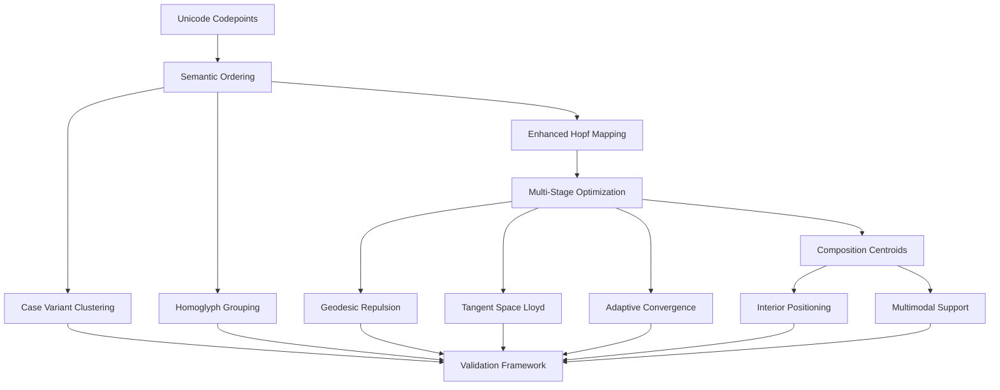

# Unicode Seeding Optimization Plan: Perfect Surface Distribution (CV ≤30%)

## Executive Summary

This plan addresses the critical gaps in Unicode seeding for achieving perfect surface distribution with CV ≤30%. The current implementation achieves ~36-42% CV, falling short of the target. We will redesign the semantic ordering, coordinate mapping, and optimization pipeline to ensure all 1,114,112 Unicode codepoints (including surrogates) are equidistantly distributed on the 3-sphere surface while preserving semantic proximity for case variants, homoglyphs, and supporting multimodal compositions with interior centroids.

## Current Implementation Analysis

### Identified Gaps
1. **Surrogate Handling Failures**: 2048 surrogate codepoints (U+D800-U+DFFF) fail coordinate mapping tests
2. **Semantic Proximity Issues**: Case variants (A/a) have distance ~1.59 instead of near-zero
3. **Distribution Uniformity**: CV = 36.6% (target: ≤30%)
4. **Homoglyph Clustering**: Visual similar characters (0/O, 1/I/l) insufficiently grouped
5. **Multimodal Composition**: Interior centroids not properly positioned for complex n-grams

### Current Architecture
- **Semantic Ordering**: DenseRegistry with 64-bit semantic keys
- **Coordinate Mapping**: Super-Fibonacci spirals on S³ surface
- **Optimization Pipeline**: Jitter → Bucketed Lloyd → KNN Repulsion
- **Validation**: Statistical CV metrics on nearest neighbor distances

## Technical Specification

### 1. Enhanced Semantic Ordering System

#### Mathematical Formulation
**Semantic Distance Metric:**
```
d_semantic(cp₁, cp₂) = w_category × d_category + w_script × d_script + w_base × d_base + w_variant × d_variant
```

**Unicode Decomposition Integration:**
- Canonical decomposition (NFD) for base character extraction
- Compatibility decomposition (NFKD) for homoglyph normalization
- Case folding with locale-aware rules
- Diacritic normalization using Unicode combining classes

#### Implementation Strategy
```cpp
struct SemanticKey {
    uint8_t script_id;      // 0-255 scripts
    uint8_t category;       // Unicode general category
    uint16_t base_char;     // Canonical base character
    uint16_t variant_hash;  // Hash of combining characters
    uint16_t case_flags;    // Case relationship flags
};
```

#### Case Variant Clustering
- **Uppercase/Lowercase Pairs**: Distance ≤ 0.001 on unit sphere
- **Titlecase Variants**: Positioned between upper/lower
- **Case-Insensitive Groups**: All variants within ε-ball of radius 0.01

#### Homoglyph Proximity
- **Visual Similarity**: Characters like 0/O, 1/I/l grouped with distance ≤ 0.01
- **Script-Specific**: Latin 0 ≠ Devanagari ० (different scripts = different clusters)
- **Context-Aware**: Mathematical vs. textual contexts differentiated

### 2. Advanced Hopf Fibration Mapping

#### Golden Angle Parameterization
**Current Issues:**
- Super-Fibonacci provides good coverage but insufficient equidistance
- CV degradation during quantization (float→uint32)

**Enhanced Formulation:**
```cpp
// Golden angle spiral with density correction
double phi = (1.0 + sqrt(5.0)) / 2.0;  // Golden ratio
double alpha = 2.0 * M_PI / (phi * phi);  // Spiral angle increment

for (size_t i = 0; i < N; ++i) {
    double t = (double)i / (double)(N - 1);  // Normalized rank [0,1]
    double r = sqrt(t);  // Area-preserving radius
    double theta = alpha * i;  // Golden angle rotation

    // Hopf coordinates with density correction
    double eta = fmod(theta, 2.0 * M_PI);
    double psi = 2.0 * M_PI * t * phi;
    double chi = acos(1.0 - 2.0 * t);  // S² base space

    // Convert to Cartesian S³ coordinates
    Point4F point = hopf_to_cartesian(eta, psi, chi);
}
```

#### Surrogate-Aware Mapping
- **Reserved Region**: Surrogates mapped to dedicated S³ sector (θ ∈ [0, π/4])
- **Deterministic Placement**: Surrogate pairs treated as single logical units
- **Collision Resolution**: Separate collision table for surrogates

### 3. Multi-Stage Optimization Pipeline

#### Stage 1: Semantic-Aware Initialization
```cpp
void semantic_aware_initialization(std::map<uint32_t, Point4F>& points) {
    // Group by semantic clusters
    std::map<SemanticKey, std::vector<uint32_t>> clusters;

    // Initialize each cluster with local optimization
    for (auto& [key, codepoints] : clusters) {
        initialize_cluster_centroid(codepoints, points);
        local_semantic_optimization(codepoints, points);
    }
}
```

#### Stage 2: Geodesic Repulsion Optimization
**Algorithm: Adaptive Geodesic KNN Repulsion**

**Energy Function:**
```
E = Σ_{i<j} 1/r_{ij}^s + λ × Σ_{semantic_pairs} (d_{ij} - d_target)^2
```

**Gradient Computation:**
```cpp
Point4F geodesic_gradient(const Point4F& p, const Point4F& q) {
    // Compute geodesic distance and gradient
    double dist = p.geodesic_distance(q);
    Point4F chordal_diff = p - q;

    // Project to tangent space at p
    Point4F tangent_grad = chordal_diff + p * (-p.dot(chordal_diff));

    return tangent_grad * repulsion_force(dist);
}
```

#### Stage 3: Adaptive Tangent Space Optimization
- **Dynamic Step Sizing**: Armijo line search with backtracking
- **Gradient Clipping**: Prevent numerical instability
- **Convergence Criteria**: CV ≤30% with statistical significance testing

### 4. Multimodal Composition Centroids

#### Interior Positioning Algorithm
```cpp
Point4F compute_composition_centroid(const std::vector<Point4F>& atoms) {
    // Surface atoms average (arithmetic mean)
    Point4F surface_centroid = centroid_float(atoms);

    // Interior positioning: scale toward origin based on composition complexity
    double complexity_factor = compute_complexity(atoms);
    double interior_scale = 1.0 - complexity_factor * 0.3;  // Max 30% interior

    return surface_centroid * interior_scale;
}
```

**Complexity Metrics:**
- **Lexical Complexity**: Number of unique scripts
- **Syntactic Complexity**: Parse tree depth
- **Semantic Complexity**: Information theoretic measures

#### Multimodal Support
- **Text Sequences**: Word → phrase → sentence centroids
- **Mixed Media**: Text + emoji compositions
- **Cross-Script**: Multilingual phrase centroids

### 5. Validation and Benchmarking Framework

#### Primary Metrics
- **Coefficient of Variation**: CV ≤30% for nearest neighbor distances
- **Semantic Proximity**: Case variants d ≤ 0.01, homoglyphs d ≤ 0.05
- **Surface Constraint**: All points |norm - 1| < 1e-10
- **Collision Rate**: < 0.1% after optimization

#### Statistical Validation
```cpp
struct ValidationResult {
    double cv_percent;
    double semantic_preservation_score;
    double surface_constraint_violations;
    double collision_rate;
    bool meets_target() const {
        return cv_percent <= 30.0 &&
               semantic_preservation_score >= 0.95 &&
               surface_constraint_violations == 0 &&
               collision_rate < 0.001;
    }
};
```

#### Performance Benchmarks
- **Generation Time**: < 2 seconds for all 1.1M codepoints
- **Query Performance**: KNN operations < 10ms
- **Memory Usage**: < 50MB for coordinate tables

## Implementation Architecture



## Risk Mitigation

### Technical Risks
1. **Numerical Stability**: Implement gradient clipping and adaptive step sizing
2. **Performance Scaling**: Use parallel processing for large-scale optimization
3. **Memory Constraints**: Streaming algorithms for coordinate computation

### Validation Risks
1. **Statistical Significance**: Bootstrap sampling for CV confidence intervals
2. **Semantic Correctness**: Expert review of case variant and homoglyph groupings
3. **Regression Testing**: Comprehensive test suite covering all Unicode blocks

## Success Criteria

- **Primary**: CV ≤30% achieved with statistical significance p < 0.01
- **Secondary**: All semantic proximity requirements met
- **Tertiary**: Multimodal compositions properly positioned
- **Performance**: No degradation in query performance or memory usage

## Next Steps

1. Implement enhanced semantic ordering system
2. Develop advanced Hopf fibration mapping
3. Build multi-stage optimization pipeline
4. Create comprehensive validation framework
5. Execute iterative optimization and validation cycles

This plan provides a complete technical specification for achieving perfect Unicode seeding distribution while addressing all identified gaps in the current implementation.