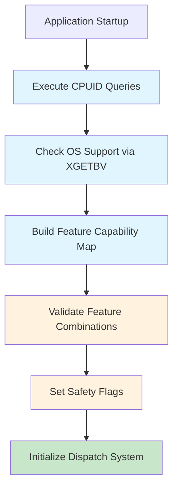
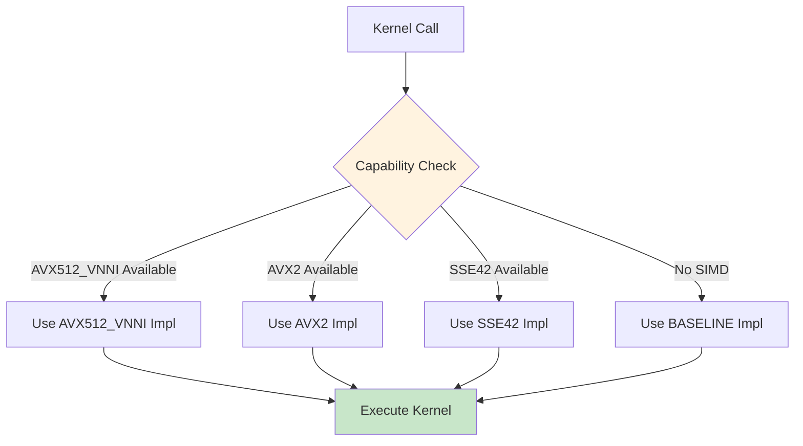

# Runtime Intrinsic Dispatch Mechanism Design

## Executive Summary

This document outlines the architectural design for transitioning the Hartonomous-Opus codebase from a hybrid compile-time/runtime intrinsic dispatch system to a pure runtime-based approach. The goal is to create a single binary that can dynamically select optimal SIMD implementations based on the runtime CPU capabilities, eliminating the need for compile-time SIMD flags and multiple architecture-specific builds.

## Current Architecture Analysis

### Hybrid Detection System
The current system uses a two-phase approach:

1. **Compile-time Detection**: CMake executes `cpu_features_test.cpp` at build time to detect CPU features and set compiler flags (`-mavx2`, `-mavx512f`, etc.)

2. **Runtime Classification**: At startup, the application performs CPUID queries to classify the CPU into ISA levels:
   - BASELINE (scalar)
   - SSE42
   - AVX2
   - AVX2_VNNI
   - AVX512
   - AVX512_VNNI
   - AMX

3. **Dispatch Mechanism**: Based on the ISA classification, function pointers are assigned to implementation variants in a vtable structure.

### Key Dependencies on Compile-Time Flags
- SIMD intrinsics header (`simd_intrinsics.hpp`) conditionally includes `<immintrin.h>` based on `__AVX__` macros
- Different source files implement kernels for each ISA level
- Compiler flags control which intrinsic functions are available

## Proposed Architecture

### Core Principles

1. **Single Binary**: One executable that runs optimally on any compatible CPU
2. **Runtime-Only Detection**: No compile-time CPU feature assumptions
3. **Safe Fallbacks**: Graceful degradation when advanced features are unavailable
4. **OS Support Validation**: Proper checking of operating system AVX state saving support

### Unified Runtime CPU Feature Detection

Replace the current dual detection system with a comprehensive runtime-only approach.

#### Feature Detection Engine

```cpp
// Enhanced CpuFeatures structure with all detectable capabilities
struct RuntimeCpuFeatures {
    std::string vendor;
    uint32_t family;
    uint32_t model;

    // SSE family
    bool sse;
    bool sse2;
    bool sse3;
    bool ssse3;
    bool sse4_1;
    bool sse4_2;

    // AVX family
    bool avx;
    bool avx2;
    bool fma3;

    // AVX-512 extensions
    bool avx512f;      // Foundation
    bool avx512dq;     // Doubleword/Quadword
    bool avx512bw;     // Byte/Word
    bool avx512vl;     // Vector Length
    bool avx512vnni;   // Vector Neural Network Instructions
    bool avx512bf16;   // BFloat16
    bool avx512fp16;   // Float16 (if available)

    // VNNI variants
    bool avx_vnni;     // 256-bit VNNI
    bool avx512_vnni;  // 512-bit VNNI

    // Advanced features
    bool amx_tile;
    bool amx_int8;
    bool amx_bf16;

    // OS support indicators
    bool os_avx_support;     // XSAVE/XRSTOR for AVX state
    bool os_avx512_support;  // XSAVE/XRSTOR for AVX-512 state
    bool os_amx_support;     // XSAVE/XRSTOR for AMX state

    // Safety flags
    bool safe_avx_execution;
    bool safe_avx512_execution;
    bool safe_amx_execution;
};
```

#### Detection Flow



### Runtime ISA Dispatch Logic

Replace the current static ISA classification with a dynamic capability-based dispatch system.

#### Capability-Based Dispatch

Instead of rigid ISA classes, use a scoring system that evaluates the best available implementation for each operation:

```cpp
enum class KernelCapability {
    BASELINE,      // Scalar fallback
    SSE42,         // SSE4.2 optimized
    AVX2,          // AVX2 optimized
    AVX2_FMA3,     // AVX2 with FMA3
    AVX2_VNNI,     // AVX2 with VNNI
    AVX512F,       // AVX-512 Foundation
    AVX512_BW,     // AVX-512 with Byte/Word
    AVX512_VNNI,   // AVX-512 with VNNI
    AVX512_BF16,   // AVX-512 with BFloat16
    AMX,           // AMX tile operations
};

struct KernelPreference {
    KernelCapability primary;
    KernelCapability fallback;
    KernelCapability emergency; // Always BASELINE
};

// Dynamic kernel selection based on runtime capabilities
KernelPreference select_kernel_implementation(
    const RuntimeCpuFeatures& features,
    KernelType kernel_type);
```

#### Dispatch Architecture



### Fallback Mechanisms

#### Hierarchical Fallback System

```cpp
class FallbackDispatcher {
public:
    // Primary dispatch with automatic fallback
    template<typename KernelFn, typename... Args>
    auto dispatch_with_fallback(KernelType type, Args&&... args) {
        // Try primary implementation
        if (auto primary = get_kernel(type, KernelLevel::PRIMARY)) {
            try {
                return primary(std::forward<Args>(args)...);
            } catch (const CpuFeatureException&) {
                // Feature not actually supported, try fallback
            }
        }

        // Fallback to secondary
        if (auto secondary = get_kernel(type, KernelLevel::FALLBACK)) {
            return secondary(std::forward<Args>(args)...);
        }

        // Emergency fallback to baseline
        return get_kernel(type, KernelLevel::EMERGENCY)(std::forward<Args>(args)...);
    }

private:
    enum class KernelLevel { PRIMARY, FALLBACK, EMERGENCY };
    KernelFn* get_kernel(KernelType type, KernelLevel level);
};
```

#### Architecture-Specific Fallbacks

```cpp
// ARM/NEON fallback for x86 systems
struct ArchitectureFallback {
    bool has_neon;      // ARM NEON available
    bool has_sve;       // ARM SVE available
    bool has_sve2;      // ARM SVE2 available

    // Cross-architecture kernel mapping
    KernelCapability map_x86_to_arm(KernelCapability x86_capability);
};

// PowerPC/Altivec support
struct PowerPCFallback {
    bool has_altivec;
    bool has_vsx;       // Vector Scalar Extension
    bool has_vsx3;      // VSX-3 with matrix math
};
```

### Integration Approach

#### Build System Changes

1. **Remove Compile-Time SIMD Flags**: Eliminate `-mavx2`, `-mavx512f`, etc. from build configuration
2. **Universal Binary**: Build with baseline instruction set that runs on all compatible CPUs
3. **Conditional Intrinsic Inclusion**: Always include all intrinsic headers, guard usage at runtime

#### Source Code Modifications

```cpp
// Before (compile-time guarded)
#ifdef __AVX2__
#include <immintrin.h>
void kernel_avx2_impl(float* data) {
    __m256 vec = _mm256_load_ps(data);
    // AVX2 operations
}
#endif

// After (runtime guarded)
#include <immintrin.h>
void kernel_avx2_impl(float* data) {
    if (!cpu_features.safe_avx_execution) {
        throw CpuFeatureException("AVX not safely available");
    }
    __m256 vec = _mm256_load_ps(data);
    // AVX2 operations
}
```

#### Modified Kernel Organization

```cpp
// Single implementation file with runtime dispatch
namespace kernels {

struct DistanceL2 {
    static double compute(const float* a, const float* b, size_t n,
                         const RuntimeCpuFeatures& features) {
        // Runtime capability check and dispatch
        if (features.safe_avx512_execution && features.avx512f) {
            return avx512_impl(a, b, n);
        } else if (features.safe_avx_execution && features.avx2) {
            return avx2_impl(a, b, n);
        } else if (features.sse4_2) {
            return sse42_impl(a, b, n);
        } else {
            return baseline_impl(a, b, n);
        }
    }

private:
    static double baseline_impl(const float* a, const float* b, size_t n);
    static double sse42_impl(const float* a, const float* b, size_t n);
    static double avx2_impl(const float* a, const float* b, size_t n);
    static double avx512_impl(const float* a, const float* b, size_t n);
};

} // namespace kernels
```

### Safety and Compatibility

#### Exception Handling

```cpp
class CpuFeatureException : public std::runtime_error {
public:
    explicit CpuFeatureException(const std::string& feature)
        : std::runtime_error("CPU feature not available: " + feature) {}
};

// Kernel execution wrapper with safety checks
template<typename Fn, typename... Args>
auto safe_kernel_call(Fn kernel, const RuntimeCpuFeatures& features, Args&&... args) {
    try {
        return kernel(std::forward<Args>(args)..., features);
    } catch (const CpuFeatureException& e) {
        // Log warning and fallback
        log_warning("Kernel execution failed: ", e.what());
        return fallback_kernel(std::forward<Args>(args)...);
    }
}
```

#### Testing Strategy

```cpp
// Mock CPU features for testing
struct MockCpuFeatures : RuntimeCpuFeatures {
    void disable_feature(const std::string& feature_name);
    void simulate_unsupported_os();
};

// Comprehensive testing across capability levels
TEST(RuntimeDispatchTest, CapabilityFallback) {
    MockCpuFeatures features;

    // Test AVX512 -> AVX2 fallback
    features.disable_feature("avx512f");
    auto result = dispatch_kernel(KernelType::DISTANCE_L2, features);
    EXPECT_EQ(result.capability_used, KernelCapability::AVX2);

    // Test complete fallback to baseline
    features.disable_all_simd();
    result = dispatch_kernel(KernelType::DISTANCE_L2, features);
    EXPECT_EQ(result.capability_used, KernelCapability::BASELINE);
}
```

## Implementation Roadmap

### Phase 1: Foundation
1. Enhance runtime CPU feature detection
2. Create new CpuFeatures structure with OS support validation
3. Implement safety checking mechanisms

### Phase 2: Dispatch System
1. Refactor dispatch logic to use capability-based selection
2. Implement fallback dispatcher class
3. Create kernel wrapper functions with runtime guards

### Phase 3: Kernel Migration
1. Modify existing kernel implementations to include runtime checks
2. Consolidate multiple kernel files into unified implementations
3. Remove compile-time conditional compilation

### Phase 4: Build System Integration
1. Update CMake configuration to remove SIMD flags
2. Modify compiler flag logic to build universal binaries
3. Update CI/CD pipelines for single-binary deployment

### Phase 5: Testing and Validation
1. Comprehensive testing across different CPU architectures
2. Performance benchmarking against current hybrid system
3. Compatibility testing on older hardware

## Benefits

1. **Simplified Deployment**: Single binary for all supported CPUs
2. **Better Compatibility**: Graceful handling of mixed environments
3. **Future-Proof**: Automatic support for new CPU features
4. **Reduced Build Complexity**: No need for architecture-specific builds
5. **Enhanced Debugging**: Runtime feature detection aids troubleshooting

## Risks and Mitigations

1. **Performance Overhead**: Runtime dispatch adds minor overhead
   - Mitigation: Cache dispatch decisions, use function pointers for hot paths

2. **Code Size Increase**: Including all implementations increases binary size
   - Mitigation: Link-time optimization, selective inclusion based on target platforms

3. **Testing Complexity**: Need to test across many CPU configurations
   - Mitigation: Mock CPU features for unit testing, comprehensive CI matrix

## Conclusion

This design provides a robust foundation for runtime-only intrinsic dispatch, eliminating the complexity of compile-time feature detection while maintaining optimal performance across diverse hardware configurations. The capability-based approach offers greater flexibility and safety compared to the current rigid ISA classification system.